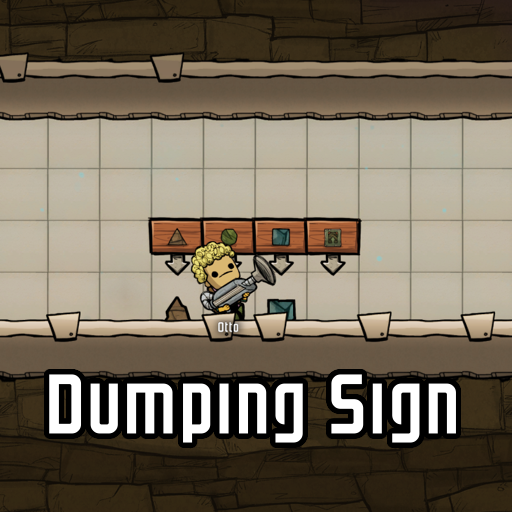
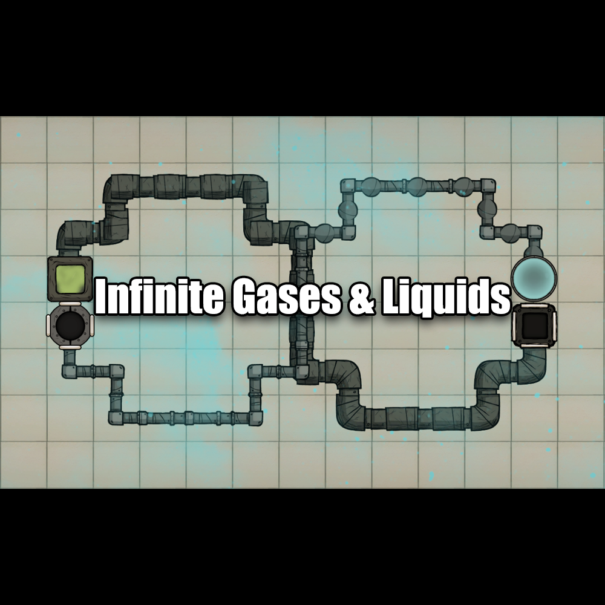
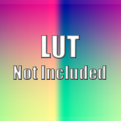
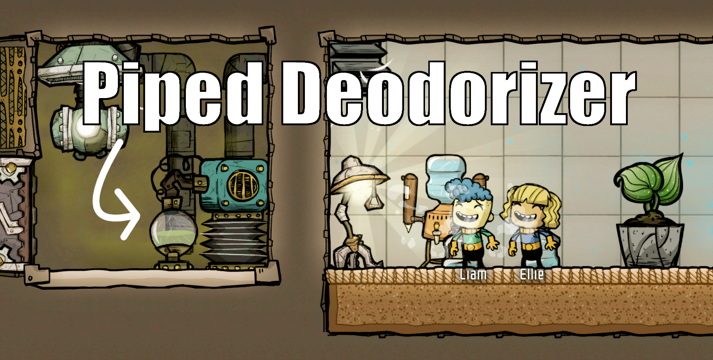
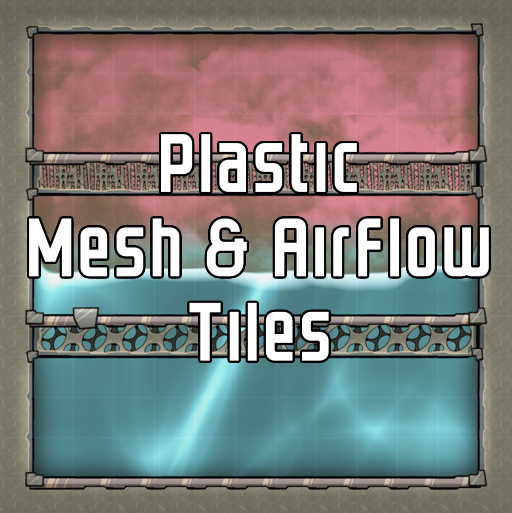
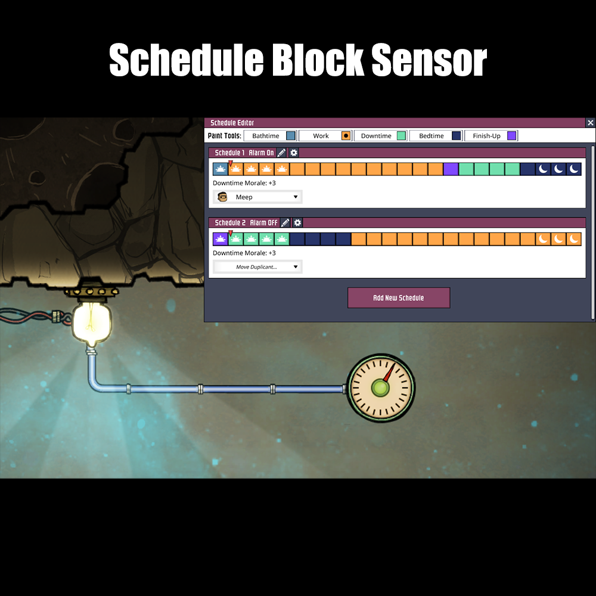
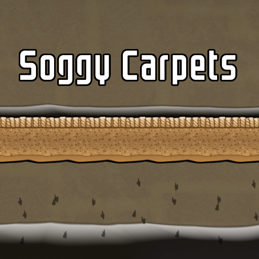
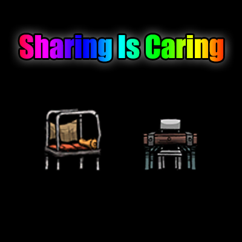

# ONI-Mods
A collection of my mods and modding tools for the game Oxygen Not Included.

## My Steam Workshop

## Modding Tools

### [Kanim Explorer](https://github.com/romen-h/kanim-explorer)
For inspecting and editing the ONI animation files.

### [ONI Runtime Editor](https://github.com/romen-h/ONI-RuntimeUnityEditor)
Tools for inspecting Unity GameObjects and Components at runtime. Modified for ONI's mod support instead of BepInEx.

## Overview of Mods

### [CommonLib](src/CommonLib)

A library that provides shared code used by multiple mods in this solution.

---

### [Dumping Sign](src/DumpingSign)

A new "storage" building that allows sweep-only materials to be delivered to a specific location and immediately dumped on the floor.

---

## [Fan Tiles](src/FanTiles)

An updated fork of test447's Fan Tiles mod.

---

## [Festive Decor](src/FestiveDecor)

A graphics replacer mod that adds a festive appearance to the colony.

---

### [Germicidal UVC Lamps](src/GermicideLamp)

A mod that adds various UVC emitting lights for disinfecting your base.

---

### [Infinite Gases & Liquids](src/InfiniteSourceSink)

A mod that adds new buildings for producing and consuming infinite amounts of fluid.

---

### [LUT Not Included](src/LUTNotIncluded)

A mod that provides custom color correction for the day and night cycle.  
This will eventually become a dependency for Festive Decor and provide an API for other mods to change the color correction at runtime.

---

### [Make Dirt](src/MakeDirt)

A mod for making dirt at the Rock Crusher.

---

### [Piped Deodorizer](src/PipedDeodorizer)

A new building that deodorizes polluted oxygen with a vent input and output.

---

### [Plastic Door](src/PlasticDoor)

A new door made of plastic that blocks gas flow, but not liquids.

*This mod was originally created by [Aki](https://github.com/aki-art/ONI-Mods), I will be maintaining it for now on.*

---

### [Plastic Mesh & Airflow Tiles](src/PermeablePlasticTiles)

Adds plastic versions of the mesh and airflow tiles.

---

### [Schedule Block Sensor](src/LogicScheduleSensor)

An automation sensor that turns on when the selected schedule enters a selected shift type. (Work, Sleep, etc.)

---

### [Soggy Carpets](src/SoggyCarpets)

Modifies Carpet Tiles to absorb liquid from above and drip it out the bottom.

---

### [Sharing Is Caring](src/SharingIsCaring)

A mod that makes beds and mess tables unassigned after dupes are done using them.

---

### [Stirling Engine](src/StirlingEngine)

A new building that converts heat energy directly into power.

---

### [Thermoelectric Coolers](src/TECBlock)

Adds a thermoelectric cooler ("TEC") tile that can move heat from one side to the other while it is powered.

---

### [Threshold Walls](src/Thresholds)

Adds new backwall buildings that can divide spaces into rooms like a door would.

---

## License

The content of this repository has been made source-available, but without license to use or copy in your own mods or other works.
Please contact me for permission to use any of this code or artwork.

© 2021 RomenH
