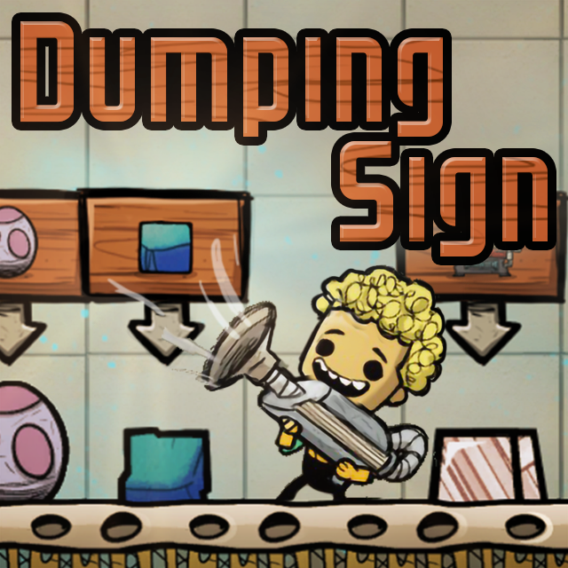
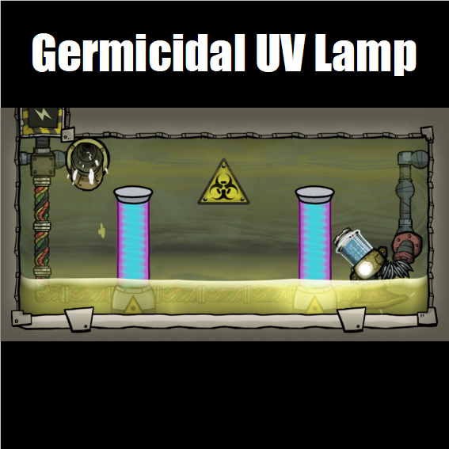
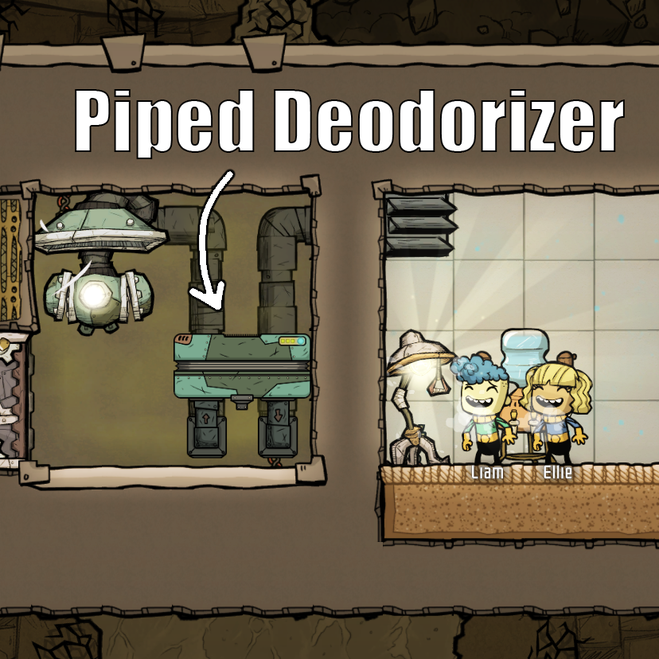
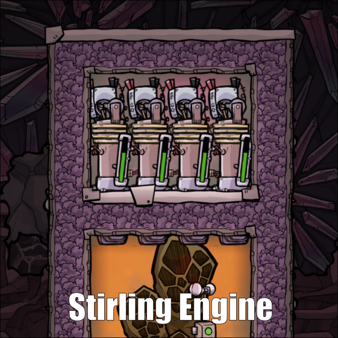
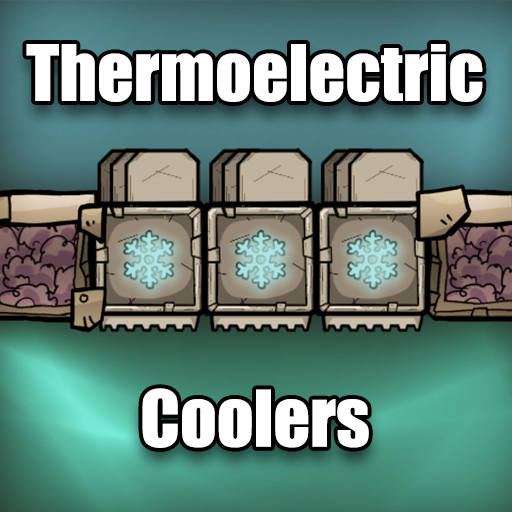
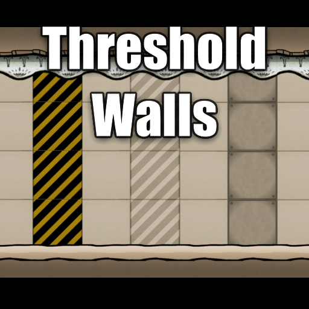

# ONI-Mods
A collection of my mods and modding tools for the game Oxygen Not Included.

## My Steam Workshop

## My Modding Tools

### [Mod Launcher](https://github.com/romen-h/ONI-ModLauncher)
A standalone mod manager and launcher for Oxygen Not Included.

### [Kanim Explorer](https://github.com/romen-h/kanim-explorer)
A tool for inspecting and editing the ONI animation files.

## My Mods

### [CommonLib](src/CommonLib)
A library that provides shared code used by multiple mods in this solution.

<table align="center">
  <tr>
    <td width="33%" align="center" valign="top">
      <h3><a href="src/DumpingSign">Dumping Sign</a></h3>
        
      </a>
      
A new "storage" building that allows sweep-only materials to be delivered to a specific location and immediately dumped on the floor.

    </td>
    <td width="33%" align="center" valign="top">
      <h3><a href="src/FanTiles">Fan Tiles</a></h3>
      
      
An updated fork of test447's Fan Tiles mod.

    </td>
    <td width="33%" align="center" valign="top">
      <h3><a href="src/FPSLimiter">Help! My GPU screams at the main menu! (FPS Limiter)</a></h3>
      
      
A small mod to cap the Unity FPS to avoid coil whine or excessive power consumption.

    </td>
  </tr>
  <tr>
    <td width="33%" align="center" valign="top">
      <h3><a href="src/GermicideLamp">Germicidal UVC Lamps</a></h3>
      
      
A mod that adds various UVC emitting lights for disinfecting your base.

    </td>
    <td width="33%" align="center" valign="top">
      <h3><a href="src/LogicScheduleSensor">Schedule Sensor</a></h3>
      
      
A new sensor that outputs a logic signal when a specific time block is active.

    </td>
    <td width="33%" align="center" valign="top">
      <h3><a href="src/MakeDirt">Make Dirt</a></h3>
      
      
A mod for making dirt at the Rock Crusher.

    </td>
  </tr>
  <tr>
    <td width="33%" align="center" valign="top">
      <h3><a href="src/DumpingSign">Piped Deodorizer</a></h3>
      
      
A new building that deodorizes polluted oxygen with a vent input and output.

    </td>
    <td width="33%" align="center" valign="top">
      <h3><a href="src/PlasticDoor">Plastic Door</a></h3>
      
      
A new door made of plastic that blocks gas flow, but not liquids.
    
*This mod was originally created by Aki. I will be maintaining it for now on.*

    </td>
    <td width="33%" align="center" valign="top">
      <h3><a href="src/PlasticTiles">Plastic Mesh & Airflow Tiles</a></h3>
      
      
Adds plastic versions of the mesh and airflow tiles.

    </td>
  </tr>
  <tr>
    <td width="33%" align="center" valign="top">
      <h3><a href="src/PlasticUtilities">Plastic Utilities</a></h3>
      
      
Adds plastic liquid and gas pipes and some decorative plastic backwalls.

    </td>
    <td width="33%" align="center" valign="top">
      <h3><a href="src/SoggyCarpets">Soggy Carpets</a></h3>
      
      
Modifies Carpet Tiles to absorb liquid from above and drip it out the bottom.

    </td>
    <td width="33%" align="center" valign="top">
      <h3><a href="src/StirlingEngine">Stirling Engine</a></h3>
      
      
A new building that converts heat energy directly into power.

    </td>
  </tr>
  <tr>
    <td width="33%" align="center" valign="top">
      <h3><a href="src/TECBlock">Thermoelectric Coolers</a></h3>
      
      
Adds a thermoelectric cooler ("TEC") tile that can move heat from one side to the other while it is powered.

    </td>
    <td width="33%" align="center" valign="top">
      <h3><a href="src/Thresholds">Threshold Walls</a></h3>
      
      
Adds new backwall buildings that can divide spaces into rooms like a door would.

    </td>
  </tr>
</table>

## License

All rights reserved. The content of this repository has been made source-available, but without license to use or copy in your own mods or other works.
Please contact me for permission to use any of this code or artwork.

© 2021 RomenH
