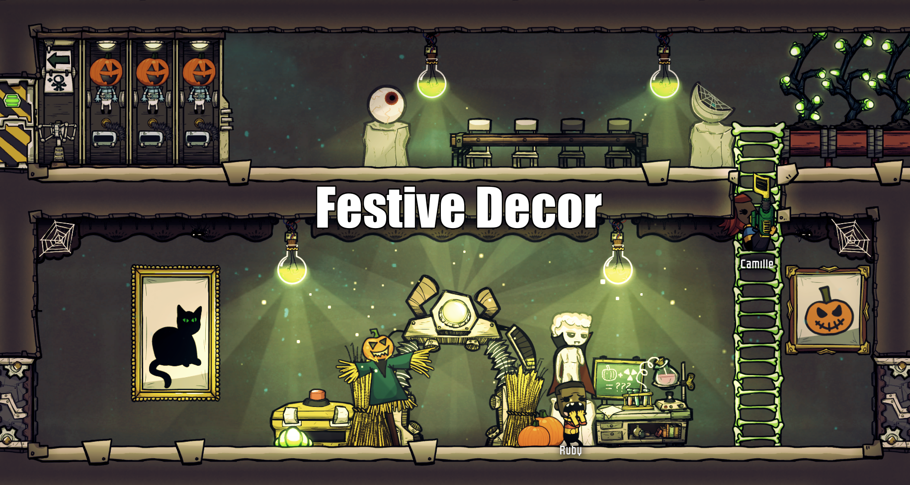

# ONI-Mods
Mods and code for the game Oxygen Not Included.

## Overview of Mods

### [CommonLib](src/CommonLib)

A library that provides shared code used by multiple mods in this solution.

---

## [Festive Decor](src/FestiveDecor)

A graphical replacer mod that adds a festive appearance to the colony.

---

### [Germicidal UVC Lamps](src/GermicideLamp)

A mod that adds various UVC emitting lights for disinfecting your base.

---

### [Make Dirt](src/MakeDirt)

A mod for making dirt at the Rock Crusher.

---

### [Stirling Engine](src/StirlingEngine)

A new building that converts heat energy directly into power.

---

## License

This repository has not been assigned a license.  
Please contact me for permission to use any of this code or artwork in your own mod.  
(I am still deciding on a license, or if certain mods need individual licenses)
